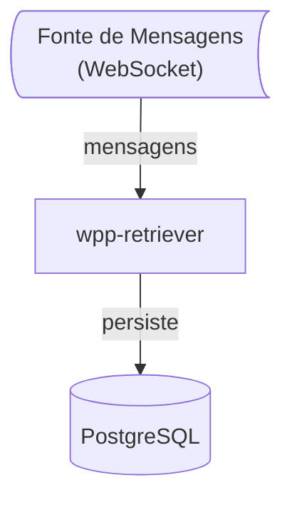
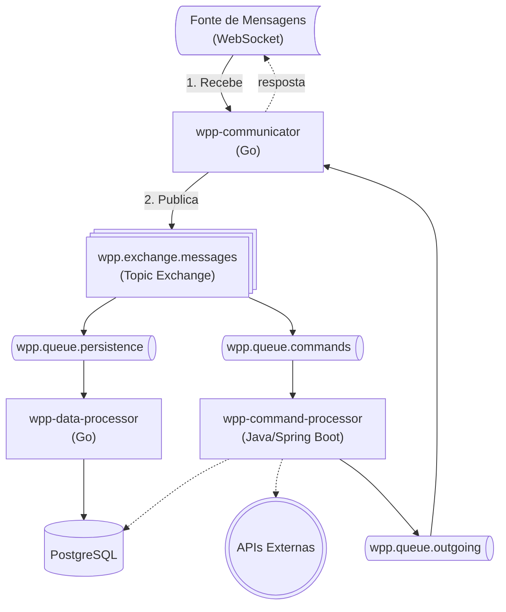

# Personal Message Center

Um centro de controle de mensagens com capacidades de armazenar metadados sobre o recebimento de mensagens, processar comandos e realizar ações.

## Status do Projeto

### Implementado
- Arquitetura base com RabbitMQ (Topic Exchange)
- Persistência de metadados no PostgreSQL
- Processamento de comandos básicos (/help, /status, /info)
- Infraestrutura Docker Compose (multi-repo)
- Comunicação bidirecional via filas
- Testes unitários (Java, Go, Node.js)

## Histórico

### V0

MVP para validar persistência direta de mensagens em banco de dados:

**Repositório**: [wpp-retriever](https://github.com/PersonalMessageCenter/wpp-retriever)

Esta versão rodou por aproximadamente **3 meses** em um **homelab** como prova de conceito. Durante esse período, coletou dados de mensagens que foram exportados em um arquivo CSV.

### Problemas Identificados

Quando analisei o CSV senti falta de algumas mensagens... nesse sentido, acho que um teste de carga poderia confirmar a hipótese se a arquitetura da V1 evita mesmo a perda de mensagens. A V1 também tem um caráter de estudo, por isso, pensei em uma arquitetura mais robusta.

- [ ] Confirmar a hipótese se a arquitetura da V1 evita a perda de mensagens

## V1

Arquitetura baseada em mensageria assíncrona com processamento paralelo.

### Arquitetura

### Fluxo de Mensagens

**Entrada:**
1. Mensagens chegam via WebSocket no `wpp-communicator`
2. São publicadas no exchange `wpp.exchange.messages`
3. O Topic Exchange distribui para múltiplas filas em paralelo:
   - `wpp-data-processor` persiste metadados
   - `wpp-command-processor` processa comandos

**Saída:**
1. Respostas são publicadas em `wpp.queue.outgoing`
2. `wpp-communicator` consome e envia de volta

**Benefício**: Processamento paralelo, escalabilidade independente e separação de responsabilidades.

### Repositórios

Este projeto é organizado em múltiplos repositórios:

| Repositório | Descrição |
|-------------|-----------|
| [wpp-infra](https://github.com/PersonalMessageCenter/wpp-infra) | Infraestrutura Docker Compose e scripts de setup |
| [wpp-communicator](https://github.com/PersonalMessageCenter/wpp-communicator) | Gateway de mensagens (Go) - recebe e publica no RabbitMQ |
| [wpp-data-processor](https://github.com/PersonalMessageCenter/wpp-data-processor) | Processador de metadados (Go) |
| [wpp-command-processor](https://github.com/PersonalMessageCenter/wpp-command-processor) | Processador de comandos (Java/Spring Boot) |
| [wpp-retriever](https://github.com/PersonalMessageCenter/wpp-retriever) | Versão V0 - persistência direta |

### Ferramentas de Teste

Para testes de carga e simulação, o projeto [chaos-socket](https://github.com/PersonalMessageCenter/chaos-socket) fornece um simulador WebSocket com perfis configuráveis.

## Como Executar

Este projeto utiliza uma estrutura **multi-repo**. O repositório [wpp-infra](https://github.com/PersonalMessageCenter/wpp-infra) centraliza a orquestração e fornece scripts para clonar todos os repositórios, subir os serviços e gerenciar o ambiente.

Consulte o [README do wpp-infra](https://github.com/PersonalMessageCenter/wpp-infra) para instruções detalhadas.

## Próximos Passos

- [ ] Confirmar hipótese de perda de mensagens via testes de carga
- [ ] Testes integrados com Gherkin/Cucumber
- [ ] Integração real com WhatsApp (whatsmeow)
- [ ] Adicionar mais comandos e funcionalidades
- [ ] Integração com APIs externas (n8n, etc)
- [ ] Monitoramento e métricas
- [ ] Disponibilizar dados coletados da V0 de forma pública/anônima
