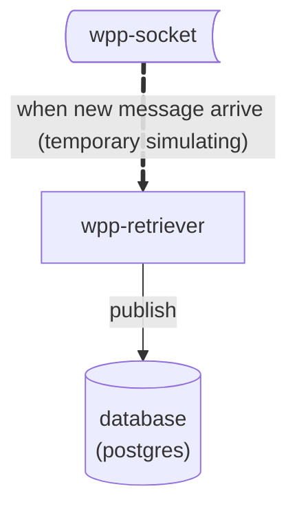
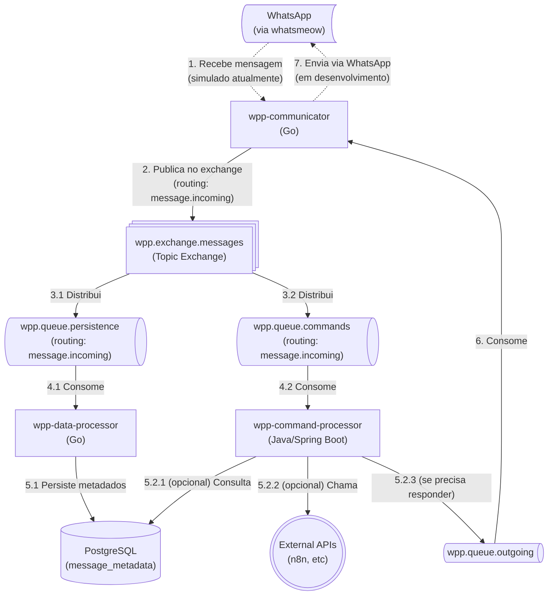

# Personal Message Center

Um centro de controle de mensagens com capacidades de armazenar metadados sobre o recebimento de mensagens, processar comandos e realizar ações.

## Status do Projeto

### ✅ Implementado
- Arquitetura base com RabbitMQ (Topic Exchange)
- Persistência de metadados no PostgreSQL
- Processamento de comandos básicos (/help, /status, /info)
- Infraestrutura Docker Compose
- Comunicação bidirecional via filas
- Testes unitários (Java, Go, Node.js)
- Maven Wrapper para execução de testes Java

## V0

Inicialmente, foi testado um MVP para apenas salvar em um banco de dados:



**Repositório**: [wpp-retriever](https://github.com/PersonalMessageCenter/wpp-retriever)

Esta versão rodou por aproximadamente **3 meses** em um **homelab** como prova de conceito. Durante esse período, coletou dados de mensagens que foram exportados em CSV. Embora seja difícil extrair métricas precisas de throughput dos dados históricos (logs podem não estar disponíveis), a experiência prática revelou limitações importantes que motivaram a arquitetura V1.

## Problemas Identificados na V0

- [ ] Confirmar hipótese: qual o throughput de mensagem? Porque tenho a sensação que muitas não são salvas... teste de carga?
- [ ] Necessidade de processamento assíncrono para melhor escalabilidade
- [ ] Separação de responsabilidades entre persistência e processamento de comandos

**Nota:** Para testes de carga futuros, o projeto **[chaos-socket](https://github.com/PersonalMessageCenter/chaos-socket)** está pronto e disponível para simular carga de mensagens.

## V1

Esta versão foi construída com arquitetura baseada em mensageria assíncrona.

### Componentes

- **[wpp-infra](https://github.com/PersonalMessageCenter/wpp-infra)**: Repositório com a infraestrutura (Docker Compose, scripts de setup)
- **[wpp-communicator](https://github.com/PersonalMessageCenter/wpp-communicator)**: Serviço Go responsável por comunicar com WhatsApp (via whatsmeow - em desenvolvimento)
- **[wpp-data-processor](https://github.com/PersonalMessageCenter/wpp-data-processor)**: Serviço Go responsável por persistir os metadados no banco de dados
- **[wpp-command-processor](https://github.com/PersonalMessageCenter/wpp-command-processor)**: Serviço Java/Spring Boot responsável por executar comandos
- **[wpp-retriever](https://github.com/PersonalMessageCenter/wpp-retriever)**: Serviço Go da arquitetura V0 (persistência direta) - usado para comparação de desempenho

### Arquitetura



### Arquitetura de Mensageria

O sistema utiliza um **Topic Exchange** (`wpp.exchange.messages`) para distribuir mensagens para múltiplos consumidores de forma paralela:

- **Exchange**: `wpp.exchange.messages` (tipo: `topic`, durable)
- **Routing Key**: `message.incoming`
- **Filas**:
  - `wpp.queue.persistence` → Consumida por `wpp-data-processor` (persiste metadados)
  - `wpp.queue.commands` → Consumida por `wpp-command-processor` (processa comandos)
  - `wpp.queue.outgoing` → Consumida por `wpp-communicator` (envia respostas)

**Benefício**: Ambos os processadores recebem **todas** as mensagens independentemente, permitindo:
- Processamento paralelo
- Escalabilidade independente
- Separação de responsabilidades

### Fluxo de Mensagens

#### Mensagem Recebida (Incoming)
1. WhatsApp → `wpp-communicator` (via whatsmeow - em desenvolvimento, atualmente simulado)
2. `wpp-communicator` publica no exchange `wpp.exchange.messages` com routing key `message.incoming`
3. Exchange distribui para ambas as filas (`wpp.queue.persistence` e `wpp.queue.commands`)
4. **Paralelo:**
   - `wpp-data-processor` persiste metadados no PostgreSQL
   - `wpp-command-processor` verifica se é comando e processa

#### Resposta a Comando (Outgoing)
1. `wpp-command-processor` identifica comando e gera resposta
2. Publica resposta em `wpp.queue.outgoing`
3. `wpp-communicator` consome e envia via WhatsApp (em desenvolvimento)

### Comandos Disponíveis

| Comando | Descrição | Status |
|---------|-----------|--------|
| `/help` | Exibe lista de comandos disponíveis | ✅ Implementado |
| `/status` | Verifica status do sistema | ✅ Implementado |
| `/info` | Retorna informações do sistema | ✅ Implementado |

### Tecnologias

- **wpp-communicator**: Go 1.21+, AMQP (RabbitMQ), whatsmeow (planejado)
- **wpp-data-processor**: Go 1.21+, AMQP (RabbitMQ), PostgreSQL
- **wpp-command-processor**: Java 17+, Spring Boot 3.2+, Spring AMQP, PostgreSQL
- **Infraestrutura**: Docker, Docker Compose, RabbitMQ, PostgreSQL

### Estrutura de Dados

#### Tabela `message_metadata` (PostgreSQL)
```sql
CREATE TABLE message_metadata (
    id UUID PRIMARY KEY,
    timestamp TIMESTAMPTZ NOT NULL,
    sender TEXT NOT NULL,
    type TEXT NOT NULL,
    status TEXT NOT NULL DEFAULT 'received',
    raw_payload JSONB NOT NULL,
    created_at TIMESTAMPTZ DEFAULT CURRENT_TIMESTAMP
);
```

## Próximos Passos

### Curto Prazo
- [ ] **Testes integrados com Gherkin/Cucumber** - Validar fluxos end-to-end do sistema
- [ ] **Testes de carga e validação de throughput** - Validar capacidade do sistema e identificar gargalos (usando `chaos-socket`)
- [ ] **Integração real com WhatsApp** - Implementar whatsmeow no `wpp-communicator` para comunicação real

### Médio Prazo
- [ ] Adicionar mais comandos e funcionalidades
- [ ] Integração com APIs externas (n8n, etc)
- [ ] Monitoramento e métricas

### Longo Prazo
- [ ] Disponibilizar dados coletados da V0 (CSV) de forma pública/anônima
