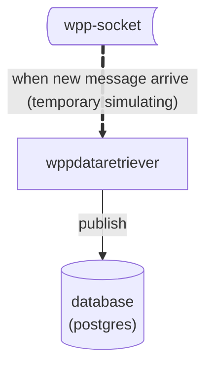
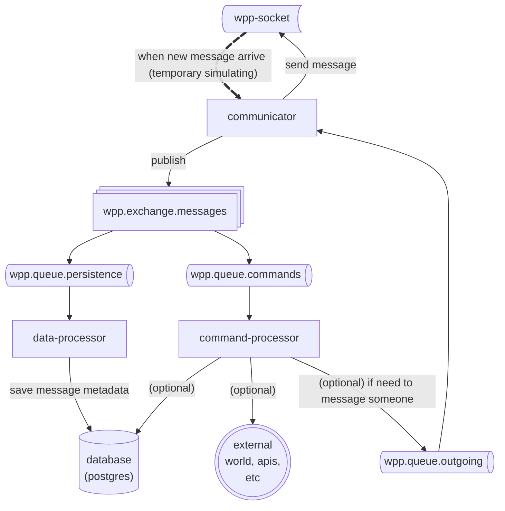

# Personal Message Center

Um centro de controle de mensagens com capacidades de armazenar metadados sobre o recebimento de mensagens, processar comandos e realizar acoes.

## V0

Iniciamente, foi testado um MVP para apenas salvar em um banco de dados:

Essa versao rodou por aproximadamente XXXXX meses em um [servidor](link do homebox) com a seguinte arquitetura:
- [ ] TODO: Confirmar a arquitetura

Esses foram os dados obtidos:
- [ ] Tratar os dados .csv
- [ ] Ver uma boa forma de deixar publico

## Problemas
Essa versao inicial pode me mostrar que:

- [ ] Confirmar hipotese: qual o throughput de mensagem? porque eu tenho a sensacao que muitas nao sao salvas... teste de carta?

## V1

Com base nesses problema, construi essa versao inicial, que consiste nas seguintes aplicacoes:

- [wpp-infra](https://github.com/PersonalMessageCenter/wpp-infra): repositorio com a infraestrutura (inicialmente em Docker)
- [wpp-communicator](https://github.com/PersonalMessageCenter/wpp-communicator): servico responsavel por comunicar com o socket
- [wpp-data-processor](https://github.com/PersonalMessageCenter/wpp-data-processor): servico responsavel por persistir os metadados no banco de dados
- [wpp-command-processor](https://github.com/PersonalMessageCenter/wpp-command-processor): servico responsavel por executar comandos

Esse e um desenho da arquitetura atual:

